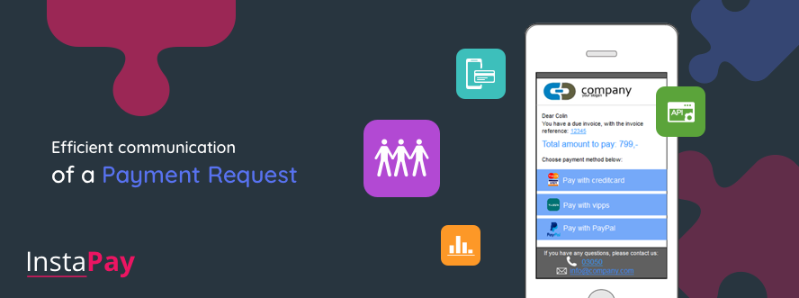

InstaPay
============

### What is InstaPay?
InstaPay lets businesses create a mobile bill and send them to customers through SMS or other communication channels. Customers can open the mobile bill and choose method of payment from a range of payment methods available and instantly pay on the go. The solution is hosted in a secure PCI-DSS certified environment.

### Philosophy:
InstaPay is intended to let businesses push a payment bill to customers. The enduser should easily
be able to choose prefered way of paying and throug as few steps possible pay on the go. InstaPay makes this easy
and handles integrations with payment providers and simplifies the settlement by easy reporting. 

### What is this used for?
InstaPay can be used to send invoices, reminders and ad-hoc payments to customers. This lets customers pay on the go. InstaPay can also be used for charity to raise funds, tickets, permits, store cardprofiles for recurring payments, membership and much more. Amongst our clients you find insurance-, utility companies, banks , charity organizations and ERP companies.

*Supported payment channels:*  Debit- Creditcards (Visa , Mastercard), Vipps, Strex 

Official documentation
----------------------

Welcome to the Intelecom InstaPay API developer pages. Here you will find everything you need to integrate InstaPay with your existing applications / systems.

### Where to start?

-   [Rest API](rest.md) - The starting point on how to integrate your system with our REST API.
-   [FTP API](ftp.md) - Integrate your system with our FTP API.

### Contact us
If you have any questions, please feel free to  [contact us](https://www.intelecom.no/vare-losninger/mobile-tjenester/sms/sms-api/kontakt/) 

You can also contact us by phone 03050 in Norway.

[www.intele.com](https://www.intele.com)
